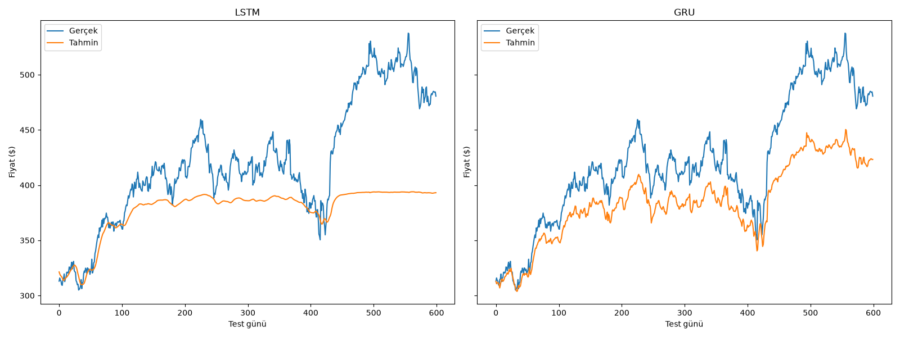
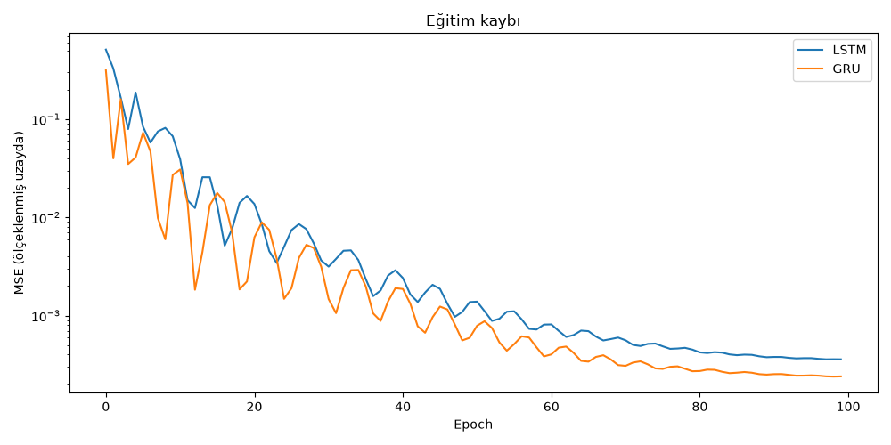
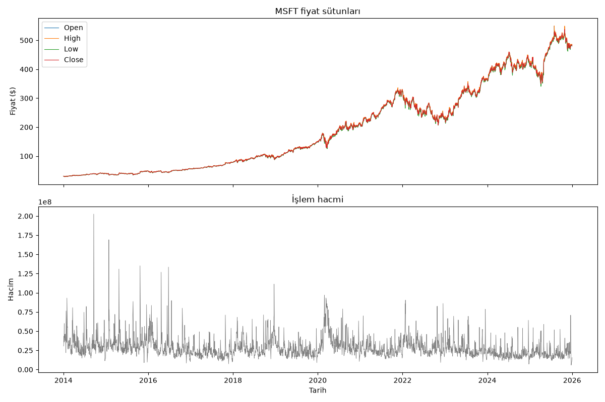

# Predictor

Bir hissenin son 20 gününe bakıp yarınki kapanışı tahmin etmeye çalışan iki sinir
ağını yarıştırıyor: LSTM ve GRU.

PyTorch ile yazıldı. İki teslimat var: baştan sona çalıştırılmış bir Jupyter notebook
ve şirket ile parametrelerin seçilebildiği bir Streamlit arayüzü.

## Proje yapısı

```
predictor/
├── src/
│   ├── data.py                  # indirme, olcekleme, pencereleme
│   ├── models.py                # LSTMModel, GRUModel
│   ├── train.py                 # egitim dongusu
│   └── evaluate.py              # MSE/RMSE ve grafik
├── notebooks/
│   └── stock_prediction.ipynb   # ana analiz
├── app/
│   ├── streamlit_app.py         # arayuz
│   └── theme.py                 # palet ve CSS
├── data/
│   └── MSFT.csv                 # 2014-2026 gunluk fiyatlar
├── results/                     # tablolar ve grafikler
├── .streamlit/config.toml
├── requirements.txt
├── README.md
├── LICENSE
├── .gitattributes
└── .gitignore
```

## Kurulum

```bash
python -m venv venv
venv\Scripts\activate
pip install -r requirements.txt
```

Notebook'u Jupyter'de açmak için venv'i kernel olarak kaydedin:

```bash
python -m ipykernel install --user --name=stock-prediction-venv --display-name "Python (stock-prediction venv)"
```

### GPU desteği (isteğe bağlı)

`requirements.txt` torch'un CPU sürümünü kuruyor. Böylece NVIDIA kartı olmayan
makinelerde de sorunsuz çalışıyor. NVIDIA kartı olan makinelerde CUDA sürümüne geçilebilir:

```bash
nvidia-smi                      # surucunun destekledigi CUDA surumunu gosterir

pip install --force-reinstall --no-deps torch==2.13.0 --index-url https://download.pytorch.org/whl/cu130
```

`--no-deps` bayrağı atlanırsa pip bütün bağımlılıkları CUDA indeksinden çözmeye
kalkıyor ve takılıyor. Windows'ta CUDA kütüphaneleri zaten wheel'in içinde geliyor,
ayrıca bir şey kurmak gerekmiyor.

Kontrol:

```bash
python -c "import torch; print(torch.__version__, torch.cuda.is_available())"
# 2.13.0+cu130 True
```

Kod cihazı kendisi seçiyor. GPU yoksa CPU'ya düşüyor, kodda değişiklik gerekmiyor.

## Çalıştırma

Notebook:

```bash
jupyter notebook notebooks/stock_prediction.ipynb
```

Arayüz:

```bash
streamlit run app/streamlit_app.py
```

venv aktive edilmediyse:

```bash
venv\Scripts\python.exe -m streamlit run app/streamlit_app.py
```

Tarayıcıda `http://localhost:8501` açılıyor. Durdurmak için terminalde `Ctrl+C`.

Bir uyarı: `python app/streamlit_app.py` şeklinde çalıştırmak işe yaramıyor, VS Code'un
Run düğmesi de aynı şeyi yapıyor. Streamlit kendi sunucusunu başlatmak zorunda; düz
Python ile koşturunca sadece "missing ScriptRunContext" uyarıları basıp çıkıyor.

Arayüzdeki şirket listesi piyasa değerine göre ilk 10'u canlı veriden çekiyor,
12 saat önbellekliyor. Listede olmayan bir sembol elle de girilebilir.

## Yöntem

Yahoo Finance'ten MSFT'nin 2014-2026 arası günlük verisi iniyor, 3018 gün.

Beş sütun (`Open`, `High`, `Low`, `Close`, `Volume`) MinMaxScaler ile `[-1, 1]`
aralığına sıkıştırılıyor. Her sütun kendi min/max'ına göre ölçekleniyor, o yüzden
hacim fiyatı ezmiyor.

Hedef `Close` için ayrı bir scaler kullanılıyor. Model tek sayı ürettiğinden, bu
değerin dolara çevrilmesi yalnızca `Close` üzerine kurulmuş bir scaler gerektiriyor.

20 günlük kayan pencerelerle diziler oluşuyor. Girdi `(örnek, 20, 5)`, hedef
`(örnek, 1)`. İlk %80 eğitim, son %20 test. Zaman serisi olduğu için karıştırma yok.

İki model de aynı ayarlarla eğitiliyor: `hidden_size=32`, `num_layers=2`,
`epochs=100`, `lr=0.01`, Adam, MSELoss.

## Sonuçlar

Beş sütunlu kurulumda, test setinde:

| Model | MSE | RMSE | Parametre |
|---|---|---|---|
| LSTM | 3 371 | 58.06 | 13 473 |
| GRU | 1 759 | 41.94 | 10 113 |

GRU hem daha isabetli hem daha hızlı. Beklenen bir sonuç, çünkü kapı yapısı daha az
parametre içeriyor.

Eğitim süresi GPU'da ikisi için de bir saniyenin altında ve makinenin o anki yüküne
göre oynuyor, o yüzden tabloda yok. Sabit olan şey oran: GRU, LSTM'den yaklaşık
**1.5 kat** hızlı bitiriyor. Güncel ölçüm için `results/model_comparison.csv`.

MSE değerleri tam sayıya yuvarlandı; GPU üzerinde cuDNN'in RNN hesaplamaları
tam deterministik olmadığı için son basamaklar çalıştırmalar arasında oynuyor.
RMSE iki ondalıkta kararlı kalıyor.

MSFT bu dönemde 28 ile 538 dolar arasında gezinmiş. Dolar cinsinden hatanın büyük
görünmesinin sebebi bu. RMSE'yi farklı hisseler arasında karşılaştırmak anlamsız.

Donanım: RTX 3050 Laptop, CUDA 13.0, torch 2.13.0+cu130.

### Eğitim ve test hatası

| Model | Train MSE | Test MSE | Train RMSE | Test RMSE | Test/Train |
|---|---|---|---|---|---|
| LSTM | 22.9 | 3 371 | 4.79 | 58.06 | 12.1× |
| GRU | 15.5 | 1 759 | 3.94 | 41.94 | 10.7× |

Model eğitim verisinde 4-5 dolar, test verisinde 42-58 dolar sapma gösteriyor.
Aradaki 10 kat fark aşırı öğrenmeye işaret ediyor.

Bu yüzden eğitim kaybı eğrisine tek başına bakmak yanıltıcı. Kayıp 0.067'den 0.0003'e
inmiş ama test performansı bunu takip etmiyor.

### Özellik seçimi deneyi (ablation)

| Kurulum | Model | RMSE |
|---|---|---|
| Sadece Close | LSTM | 46.03 |
| Sadece Close | GRU | **22.97** |
| OHLCV | LSTM | 58.06 |
| OHLCV | GRU | 47.99 |

Sonuç beklenenin tersi. Nedeni korelasyon tablosunda görülüyor:

| Sütun | Close ile korelasyon |
|---|---|
| Open | 0.9998 |
| High | 0.9999 |
| Low | 0.9999 |
| Volume | −0.2399 |

`Open`, `High`, `Low` neredeyse `Close`'un aynısı, yeni bilgi taşımıyorlar. `Volume`
da fiyatla pek ilgili değil. Ama girdi 1'den 5 sütuna çıkınca model daha fazla
parametre öğrenmek zorunda kalıyor ve aynı epoch bütçesinde bu yükü kaldıramıyor.

### Hiperparametre denemeleri

| Kurulum | LSTM | GRU | GRU Test/Train |
|---|---|---|---|
| Temel (lookback=20, hidden=32) | 58.06 | 47.99 | 10.7× |
| lookback=10 | 59.09 | 47.85 | 9.6× |
| lookback=40 | 56.71 | 47.81 | 10.8× |
| **hidden=16** | 69.24 | **24.67** | **5.4×** |
| dropout=0.2 | 62.55 | 46.28 | 8.9× |

En iyi sonuç GRU'yu küçültmekten geldi. `hidden_size` 16'ya inince test hatası
47.99'dan 24.67'ye düştü, ezberleme oranı da 10.7'den 5.4'e.

Model veri setine göre fazla büyüktü. Kapasite sınırlandığında ezberleme imkanı
azalıyor ve model genellemeye yöneliyor.

Dropout aynı yönde etki etti ancak katkısı daha sınırlı kaldı. Pencere uzunluğundaki
değişiklikler sonucu belirgin biçimde etkilemedi. Aynı küçültme LSTM'de ters etki
yaptı; ek kapı yapısı daha fazla parametre gerektirdiğinden 16 birim yetersiz kalıyor.

### CPU ve GPU karşılaştırması

| Model | CPU | GPU | Kazanç | RMSE (ikisinde de) |
|---|---|---|---|---|
| LSTM | 5.45 s | 0.83 s | 6.6× | 58.06 |
| GRU | 7.05 s | 0.80 s | 8.9× | 47.99 |

RMSE iki cihazda da aynı çıkıyor. GPU sadece hızı değiştiriyor, sonucu değil.

## Grafikler

**Tahminler**



Tahmin ve gerçek eğriler birbirine çok yakın görünüyor, ancak bu görüntü yanıltıcı.
Günlük değişim %1-2 mertebesindeyken eksen 300-550 dolar aralığını kapsıyor. Bu
ölçekte, ertesi günü bugüne eşitleyen bir model bile benzer bir eğri üretir.

**Eğitim kaybı**



Logaritmik eksende, çünkü kayıp 0.067'den 0.0003'e iniyor. Normal eksende son
iyileşmeler görünmezdi.

**Veri**



`results/` altındakiler:

| Dosya | İçerik |
|---|---|
| `model_comparison.csv` | LSTM vs GRU, MSE/RMSE/süre |
| `train_vs_test.csv` | Eğitim ve test hataları |
| `feature_ablation.csv` | Tek sütun vs beş sütun |
| `hyperparameter_tuning.csv` | Pencere, kapasite, dropout denemeleri |

## Sınırlamalar

Ölçekleyici train/test ayrımından önce tüm veriye uygulanıyor. Referans alınan çalışma
da böyle yapıyor ama teknik olarak doğrusu değil: test kümesinin min/max bilgisi
eğitime sızıyor. Düzeltilirse hata değerleri biraz yükselir.

Hisse fiyatı tahmin etmek zor bir iş. Piyasalar haberlerden, makroekonomik olaylardan,
yatırımcı psikolojisinden etkileniyor ve geçmiş örüntüler geleceği garanti etmiyor.

Narayanan ve Kapoor'un *AI Snake Oil* çalışması tam da bu ayrımı konu ediyor:
etkileyici görünen çıktılar ile gerçek tahmin gücü aynı şey değil. Yukarıdaki
eğitim/test tablosu bunun sayısal karşılığı.

Bu bir öğrenme projesi, yatırım tavsiyesi değil.

## Çıkarımlar

Bu projenin en somut dersi ölçüm disiplini oldu. Eğitim kaybı eğrisi modelin
öğrendiğini söylüyordu, test hatası tersini gösterdi. Doğru olan ikincisiydi.

İkincisi özellik seçimiyle ilgili. Daha fazla sütun sezgisel olarak daha fazla bilgi
anlamına geliyor, ama ablation deneyi bu varsayımı çürüttü.

Model kapasitesinde de benzer bir durum var. Küçültmenin sonucu iyileştirmesi beklenen
bir davranış değil.

Metriklerin birimi ayrı bir dikkat noktası: ölçeklenmiş uzaydaki kayıp ile dolar
cinsinden RMSE aynı büyüklüğün iki farklı gösterimi.

## Geliştirme önerileri

Teknik göstergeler denenebilir; hareketli ortalama ya da RSI gibi türetilmiş sütunlar
ham OHLCV'nin aksine gerçekten yeni bilgi taşıyabilir.

Erken durdurma ezberlemeyi engelleyebilir.

Scaler'ı sadece eğitim kümesine uygulayıp sızıntıyı kapatmak gerekiyor.

## Kaynaklar

Yaklaşım Rodolfo Saldanha'nın [Stock Price Prediction with PyTorch](https://medium.com/swlh/stock-price-prediction-with-pytorch-37f52ae84632)
yazısına dayanıyor: MinMax ölçekleme, 20 günlük pencere, aynı ayarlarla eğitilen
LSTM/GRU karşılaştırması. Veri kaynağı olarak yfinance, hisse olarak MSFT,
çok değişkenli girdi ve ablation/tuning deneyleri eklendi.

Eleştirel bakış için: Narayanan & Kapoor, [*AI Snake Oil*](https://press.princeton.edu/books/hardcover/9780691249131/ai-snake-oil).

## Lisans

MIT. Ayrıntı için [LICENSE](LICENSE).
